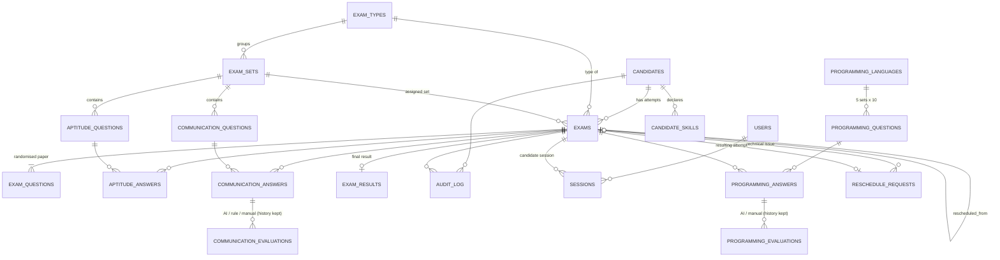

# Data Model

The primary application database is SQLite (`server/db/schema.sql`). All timestamps are stored as ISO-8601 UTC strings, for example `2026-09-23T10:15:00.000Z`. Human-readable IDs are sequential and scoped to the year:

| Entity | Format | Example |
|---|---|---|
| Candidate | `CAN-YYYY-NNNNN` | CAN-2026-00001 |
| Exam (assignment) | `EXAM-YYYY-NNNNN` | EXAM-2026-00001 |
| Attempt | `ATT-YYYY-NNNNN` | ATT-2026-00001 |
| Result | `RES-YYYY-NNNNN` | RES-2026-00001 |
| Evaluation | `EVAL-YYYY-NNNNNN` | EVAL-2026-000001 |
| Audit log | `LOG-YYYY-NNNNNN` | LOG-2026-000001 |
| Reschedule request | `RSR-YYYY-NNNNN` | RSR-2026-00001 |
| Programming question | `PRG-<LANG>-S<set>-<nn>` | PRG-JAVA-S3-07 |

## Relationships

This implements the required chain: Candidate → Exam Assignment / Attempt (`exams`) → Exam Set → Aptitude Questions → Aptitude Answers, and Communication Questions → Communication Answers → Communication Evaluation → Final Result (`exam_results`).

## Tables

| Table | Purpose | Key columns |
|---|---|---|
| `candidates` | Candidate Master: every field in the specification, plus summary fields that mirror the latest attempt | `candidate_code` (unique), `email` (unique, case-insensitive), `candidate_status`, `exam_status`, `selected_exam_set`, `aptitude_*`, `communication_*`, `total_*`, `final_status` |
| `exam_types` | Modular exam definitions (sections, question counts, kinds) | `code`, `config` JSON |
| `exam_sets` | SET-01 … SET-NN, each belonging to an exam type | `code`, `active` |
| `aptitude_questions` | Question ID, Exam Set, Category, Topic, Difficulty, Question, optional data table, Options A–D, Correct Answer, Marks, Explanation, Active | `code` (APT-S01-01) |
| `communication_questions` | Question ID, Exam Set, Category, Question, Expected Word Count (min/max), Marks, Active | `code` (COM-S01-01) |
| `exams` | One row per **attempt**: exam and attempt IDs, candidate, set, attempt number, status, assignment method, retake reason/approval, token and access-code hashes, link expiry, start/deadline/submit times, timing JSON, submission type, tab switches, suspicious events, IP address, browser, resume count | `exam_code`, `attempt_code`, `(candidate_id, attempt_number)` |
| `exam_questions` | The randomised paper fixed at assignment time: question order and the per-question option order (for example `["C","A","D","B"]`) | `(exam_id, section, question_id)` |
| `aptitude_answers` | Selected answer (stored as the **original** letter), marked for review, is_correct, marks, first and last answer times, change count | `(exam_id, question_id)` |
| `communication_answers` | Answer text **exactly as submitted**, word count, marked for review | `(exam_id, question_id)` |
| `communication_evaluations` | Every evaluation is kept. `source` is `ai` / `rule` / `manual`; also provider, model, five rubric scores (/20), total (/100), question score (/10), feedback, strengths, improvements, evaluator comments and the raw AI response. `is_current` marks the one used for scoring | `evaluation_code` |
| `exam_results` | Aptitude score/max/percentage and category breakdown; communication score/max/percentage and average rubric; final score, status (Pending Evaluation / PASS / FAIL), scoring snapshot (weights, thresholds and reasons at the time of calculation), strengths, improvements, evaluator comments, finalised by/at | `result_code`, `exam_id` (unique) |
| `audit_log` | Log ID, Candidate, Exam, User, Actor, Event, Timestamp, IP Address, Browser, Details (JSON) | `log_code` |
| `users` / `sessions` | Staff accounts (bcrypt password hashes, lockout); staff and candidate sessions (token hash only, idle expiry, revocation reason) | |
| `settings` | Runtime configuration; secrets are AES-256-GCM encrypted | `key` |
| `email_outbox` | Every notification: queued / sent / logged / failed, with retries | |
| `sync_queue` | Pending changes for Google Sheets / SharePoint | `entity`, `entity_key`, `status` |
| `counters` | Year-scoped sequences for human-readable IDs | |
| `candidate_skills` | Skill, category, level (Beginner…Expert), years, source (hr / candidate) | `(candidate_id, skill)` |
| `programming_languages` | Supported test languages; admin can add or deactivate | `key` |
| `programming_questions` | Language, set number, topic, task type, difficulty, question, starter code, **reference solution**, evaluation points, test cases, minutes, marks, active | `code` |
| `programming_answers` | Code or explanation exactly as typed, line and character counts, marked for review | `(exam_id, question_id)` |
| `programming_evaluations` | ai / manual / rule (blank) with correctness, logic, code_quality, efficiency, edge_cases, total, question score, verdict, feedback, strengths, improvements, issues; history kept | `evaluation_code` |
| `reschedule_requests` | Reason category, description, incident time, evidence notes, **system evidence JSON**, requested option, extra minutes, proposed window, status (Pending/Approved/Rejected/Withdrawn), requester, approver, decision notes, resulting exam | `request_code` |

New columns (added automatically on existing databases):

- `exams`: `programming_language`, `programming_set`, `available_from`, `counts_as_attempt`, `rescheduled_from_exam_id`, `void_reason`. The new `Voided` status marks an attempt replaced by a reschedule.
- `exam_results`: `programming_score`, `programming_max`, `programming_percentage`, `programming_evaluated`, `programming_breakdown`, `programming_rubric`.
- `candidates`: `programming_language`, `programming_score`, `programming_percentage`.

### Mapping to the specification's SQL objects (§30)

| Spec object | Implementation |
|---|---|
| Candidate | `candidates` |
| Exam (exam_id, candidate_id, exam_set, attempt, status, start/end) | `exams` |
| AptitudeQuestion | `aptitude_questions` |
| AptitudeAnswer | `aptitude_answers` |
| CommunicationQuestion | `communication_questions` |
| CommunicationAnswer | `communication_answers` |
| CommunicationEvaluation | `communication_evaluations` |
| ExamResult | `exam_results` |
| AuditLog | `audit_log` |

## External backend layout

Every sheet or list uses the column set from the specification (§18), plus a few useful extras appended at the end. On SharePoint, **Title holds the unique key** (the Sync Key); on Google Sheets the key is in the last column, *Sync Key*. Candidate ID is the relationship between all lists. Records are **upserted**: an existing row is updated, never duplicated.

| Entity | Google Sheet tab | SharePoint list | Row key |
|---|---|---|---|
| Candidates (full Candidate Master) | Candidates | Candidate Master | Candidate ID |
| Exam attempts (assignment, set, attempt, integrity data) | Exam Attempts | Exam Attempts | Exam ID |
| Exam results | Exam Results | Exam Results | Exam ID |
| Aptitude answers | Aptitude Answers | Aptitude Responses | Exam ID \| Question ID |
| Communication answers + evaluation | Communication Answers | Communication Responses | Exam ID \| Question ID |
| Aptitude question bank | Question Bank | Question Bank | Question ID |
| Communication question bank | Communication Question Bank | Communication Question Bank | Question ID |
| Audit log | Audit Log | Audit Log | Log ID |
| Programming answers + evaluation | Programming Answers | Programming Responses | Exam ID \| Question ID |
| Programming question bank | Programming Question Bank | Programming Question Bank | Question ID |
| Candidate skills | Candidate Skills | Candidate Skills | Candidate ID \| skill |
| Reschedule requests | Reschedule Requests | Reschedule Requests | Request ID |

Answers are synchronised only after submission. In-progress answers stay in the application database until then.
